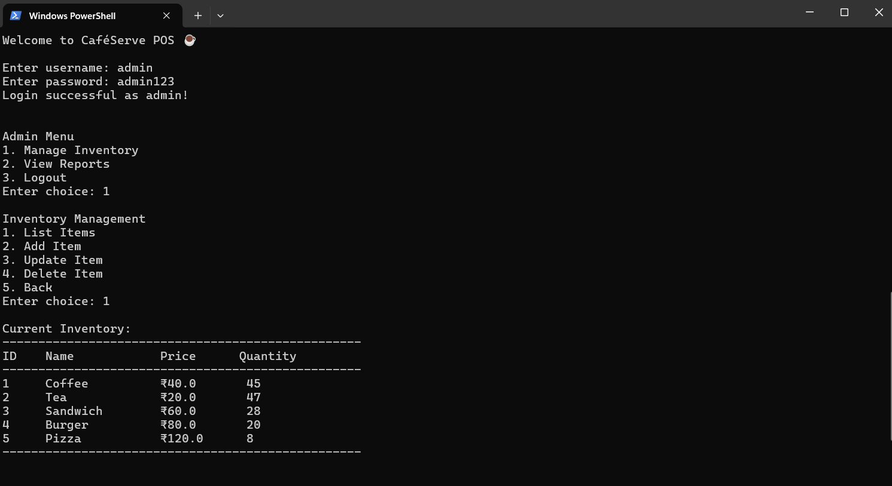

# ☕ CaféServe POS – Python + SQLite


CaféServe POS is a clean and efficient **Point-of-Sale & Inventory System** built using **Python** and **SQLite**, designed to manage daily café operations.
Includes billing, inventory, order tracking, reports, and a secure **🔐 Role-Based Login System**.

---

## 🚀 Features

### 🔐 Role-Based Login System
- Admin and Staff login  
- Role-based restricted access  
- Admin → Full control  
- Staff → Orders + View Inventory  

---

## 📋 Inventory Management
- Add items  
- Update item price & quantity  
- Delete items  
- View all items  
- Quantity validation during billing  

---

## 💰 Order Processing & Billing
- Create customer orders  
- Auto-calculate total price  
- Update inventory stock  
- Save order history in SQLite  

---

## 📊 Sales & Inventory Reports
- View all completed orders  
- Calculate total sales  
- Admin-only access  

---

## 🛠️ CRUD Operations
- Full Create, Read, Update, Delete support  
- SQLite database (`cafe.db`) auto-created  

---

## 👩‍💼 Roles & Access

- **Admin** → Full Access (Inventory, Reports, Orders)  
- **Staff** → Limited Access (Take Orders, View Inventory)  

---

## 🧪 Sample Users

| Username | Password | Role  |
|----------|----------|--------|
| admin    | admin123 | admin |
| staff    | staff123 | staff |

---

## 🧑‍💻 Technologies Used

### 🐍 Python  
Used for all business logic, authentication, menus, billing.

### 🗄️ SQLite  
Used to store:  
- Users  
- Inventory items  
- Orders  
- Sales history  

### 📦 Modular Code Structure
- `auth.py` – Authentication + Roles  
- `inventory.py` – CRUD operations  
- `order.py` – Billing logic  
- `report.py` – Sales reporting  
- `db_config.py` – SQLite database connection  
- `main.py` – Application workflow  

---

## 🏗️ Folder Structure

```
Cafe Management System/
│
├── main.py                # Main application
├── db_config.py           # SQLite connection
├── auth.py                # Login & Roles
├── inventory.py           # CRUD operations
├── order.py               # Billing system
├── report.py              # Sales report
├── schema.sql             # Old MySQL schema (optional)
├── README.md              # Documentation
│
└── assets/                # Screenshots folder
    └── output.png         # Real execution screenshot
```

---

## 🖥️ Console Output (Real Execution Screenshot)



---

## 📸 Terminal Output Example

```
Welcome to CaféServe POS ☕
Enter username: admin
Enter password: ******
Login successful as admin!

1. Manage Inventory
2. View Reports
3. Take Order
4. Logout
Enter your choice: _
```

---

## ▶️ How to Run

### 1️⃣ Optional: Install dependencies  

```bash
pip install -r requirements.txt
```

### 2️⃣ Run the application

```bash
python main.py
```

`cafe.db` will be auto-created with required tables.

---

## ✨ Created By  
**Gundugollu Mohana Venkata Achuta Lakshmi**

*(Self-Initiated Project)*  

🌟 If you like this project, give it a **star ⭐**!
